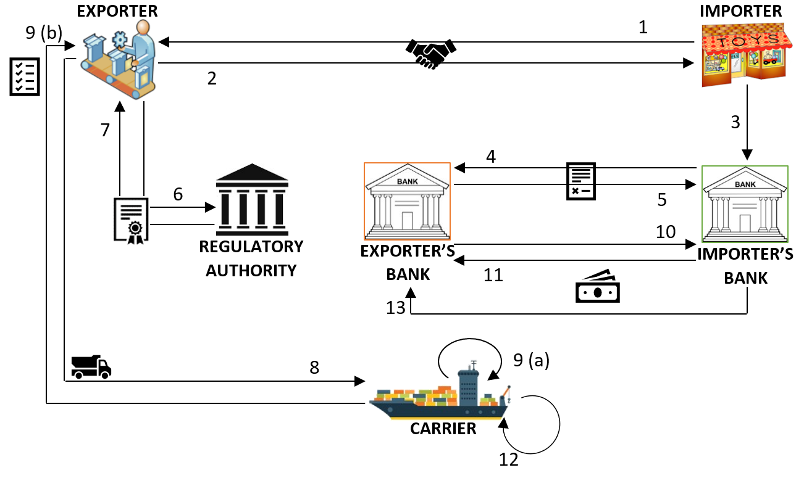

# Trade Application
This is a use case on trade finance and logistics, designed to demonstrate the capabilities of Hyperledger (mainly Fabric) blockchain tools.

# Use Case Scenario Overview
The trade scenario consists of 6 participants:
- *Exporter*: An entity that is selling goods
- *Importer*: An entity that is buying goods from an exporter in exchange for money
- *Importer's Bank*: Maintains a bank account for an importer, and issues a Letter of Credit on its behalf
- *Exporter's Bank*: Maintains a bank account for an exporter, and handles L/Cs and payments on its behalf
- *Carrier*: Entity that ships goods from exporter's to importer's location.
- *Regulatory Auhority*: Public or governmental body that approves the export of goods, and audits the process

The flow diagam below illustrates the steps from a trade agreement to the final payment settlement.
(For more details, see the [full description](docs/Use-Case-Description.docx).



# Application folder structure
```
./
├── chaincode
├── middleware
└── application
└── composer
└── network
└── docs
└── README.md
```
The [chaincode](chaincode) folder contains the source code for all versions of the chaincode.

The [middleware](middleware) folder contains wrapper functions that use the Fabric SDK library to implement channel and chaincode operations.

The [application](application) folder contains code to start a web server and offer a REST API for users to register, login,
set up the channel and application, and run trade operations.

The [network](network) folder contains configurations and code to launch a single-machine Docker network setup corresponding to a minimal
version of the trade application scenario.

The [docs](docs) folder contains more documentation on the use case.

# Testing and Running the Application
To test and run the complete application, you will need to perform the following steps in sequence:
- **Test the chaincode (smart contract)**: Navigate to the [chaincode](chaincode) folder for instructions.
- **Launch a trade network**: Navigate to the [network](network) folder for instructions.
- **Prepare the middleware**: Navigate to the [middleware](middleware) folder for instructions.
- **Start and exercise the application server**: Navigate to the [application](application) folder for instructions.

# Augmenting the Application
Two kinds of augmentation are currently supported:
## Add a New Organization and Peers
- See instructions in [network](network) to create configuration files for the new organization and peers.
- See instructions in [middleware](middleware) to update the running application to incorporate the new organization and peers.
.. Alternatively, see instructions in [application](application) to upgrade chaincode through the application server.
## Upgrade Chaincode
- (*Note*: the upgrade version of the chaincode in this repository assumes that the new organization has already been added above.
...To test chaincode upgrade without new organizations, modify and test the upgrade version of the chaincode suitably.)
- See instructions in [chaincode](chaincode) to validate the upgrade version, or apply custom modifications followed by unit testing.
- See instructions in [middleware](middleware) to upgrade chaincode in a running trade application.
.. Alternatively, see instructions in [application](application) to upgrade chaincode through the application server.
